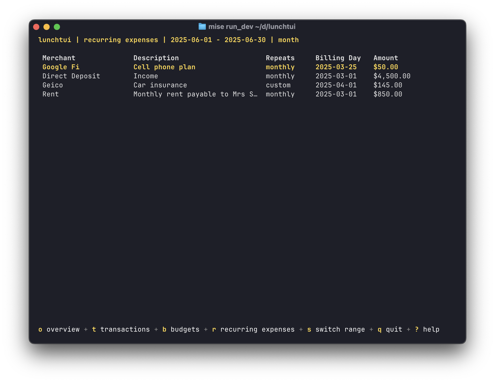

<div align="center">

# 🍽️ lunchtui

**A beautiful command-line interface for your [Lunch Money](https://lunchmoney.app/) account**

[](https://goreportcard.com/report/github.com/Rshep3087/lunchtui)
[](https://opensource.org/licenses/MIT)
[](https://golang.org/)
[](https://github.com/Rshep3087/lunchtui/releases/)
[](https://github.com/Rshep3087/lunchtui/stargazers)


*Manage your finances directly from your terminal with style and efficiency*

</div>

---

## 📋 Table of Contents

- [✨ Features](#-features)
- [🚀 Installation](#-installation)
- [📖 Usage](#-usage)
- [🔧 CLI Commands](#-cli-commands)
- [🔧 Configuration](#-configuration)
- [📸 Screenshots](#-screenshots)
- [🤝 Contributing](#-contributing)
- [📄 License](#-license)
- [🙏 Acknowledgments](#-acknowledgments)

## ✨ Features

- 💰 **Account Balances** - View all your account balances at a glance
- 🔄 **Recurring Expenses** - Monitor your subscription and recurring payments
- 📊 **Transaction Management** - Browse and search through your transactions
- 📈 **Budget Tracking** - Monitor your spending against budgets with real-time progress
- 🏷️ **Smart Categorization** - Easily categorize transactions with intuitive interface
- ✅ **Transaction Status** - Mark transactions as cleared or uncleared
- 🎨 **Beautiful UI** - Enjoy a clean, modern terminal interface built with Bubble Tea
- ⚡ **Fast & Lightweight** - Built in Go for optimal performance

## 🚀 Installation

### Option 1: Download Pre-built Binary

Download the latest release from the [releases page](https://github.com/Rshep3087/lunchtui/releases) and extract the binary to a location in your PATH.

### Option 2: Install with Go

```bash
go install github.com/Rshep3087/lunchtui@latest
```

### Option 3: Build from Source

```bash
git clone https://github.com/Rshep3087/lunchtui.git
cd lunchtui
go build -o lunchtui
```

## 📖 Usage

### Quick Start

```bash
# Set your API token
export LUNCHMONEY_API_TOKEN="your-api-token-here"

# Launch lunchtui
lunchtui
```

### Navigation

Once lunchtui is running, use these keyboard shortcuts to navigate:

| Key | View | Description |
|-----|------|-------------|
| `o` | Overview | Account balances and financial summary |
| `t` | Transactions | Browse and manage your transactions |
| `b` | Budgets | View budget progress and spending by category |
| `r` | Recurring | Monitor recurring expenses and subscriptions |
| `g` | Configuration | View current configuration settings (sensitive values are masked) |
| `[` / `]` | - | Navigate between previous/next time periods |
| `s` | - | Switch between time period types (month/year) |
| `?` | - | Toggle help menu |
| `q` | - | Quit the application |

### Command Line Options

| Flag | Description | Default |
|------|-------------|----------|
| `--token` | Lunch Money API token | Uses `LUNCHMONEY_API_TOKEN` env var or config file |
| `--debits-as-negative` | Show debits as negative numbers | `false` |
| `--config` | Path to custom configuration file | Standard locations |
| `--debug` | Enable debug logging | `false` |
| `--help` | Show help message | - |

### Examples

```bash
# Use a specific API token
lunchtui --token="your-token-here"

# Show debits as negative values
lunchtui --debits-as-negative

# Use a custom configuration file
lunchtui --config /path/to/my-config.toml

# Enable debug logging
lunchtui --debug

# Combine options (flags override config file)
lunchtui --token="your-token" --debits-as-negative --debug
```

## 🔧 CLI Commands

In addition to the interactive TUI interface, lunchtui provides powerful CLI commands for automation and scripting.

### Available Commands

#### Transaction Management

##### `lunchtui transaction insert`
Insert a new transaction directly from the command line.

**Usage:**
```bash
lunchtui transaction insert --payee "Coffee Shop" --amount "4.50" [options]

# Basic transaction
lunchtui transaction insert --payee "Grocery Store" --amount "45.67"

# Transaction with category and notes
lunchtui transaction insert --payee "Gas Station" --amount "35.00" --category 123 --notes "Weekly fill-up"

# Income transaction (negative amount)
lunchtui transaction insert --payee "Freelance Work" --amount "-500.00" --status cleared

# Transaction with tags
lunchtui transaction insert --payee "Restaurant" --amount "25.50" --tags 1 --tags 2
```

#### Categories Management

##### `lunchtui categories list`
List all categories with their IDs and details.

**Usage:**
```bash
# List categories in table format
lunchtui categories list

# List categories in JSON format
lunchtui categories list --output json
```

#### Accounts Management

##### `lunchtui accounts list`
List all accounts (both assets and Plaid accounts) with their IDs and details.

**Usage:**
```bash
lunchtui accounts list [options]
```

### Global Flags

All commands support these global flags:

- `--token` - Lunch Money API token (can use `LUNCHMONEY_API_TOKEN` env var)
- `--debits-as-negative` - Show debits as negative numbers
- `--debug` - Enable debug logging

### Getting Help

Use the `--help` flag with any command to see detailed usage information:

```bash
# General help
lunchtui --help

# Command-specific help
lunchtui transaction --help
lunchtui categories list --help
```

🚧 **More CLI commands are coming soon!**

## 🔧 Configuration

### Configuration File Support

Lunchtui supports TOML configuration files to set default values for commonly used options. This eliminates the need to specify flags repeatedly.

**Configuration file locations** (in order of precedence):
- Current directory: `lunchtui.toml`
- User config: `~/.config/lunchtui/config.toml`
- User home: `~/.lunchtui.toml`
- System-wide: `/etc/lunchtui/config.toml`

**Example configuration file:**
```toml
# lunchtui.toml
debug = true
token = "your-api-token-here"
debits_as_negative = false
```

You can also specify a custom config file with `--config path/to/config.toml`.

**📋 For complete configuration documentation, see [CONFIG.md](CONFIG.md)**

### API Token Setup

1. Log into your [Lunch Money account](https://my.lunchmoney.app/)
2. Navigate to **Settings** → **Developers**
3. Create a new API token
4. Set the token via configuration file or environment variable:

```bash
# Option 1: Environment variable
export LUNCHMONEY_API_TOKEN="your-api-token-here"

# Option 2: Configuration file
echo 'token = "your-api-token-here"' > lunchtui.toml
```

## 📸 Screenshots

### 📈 Budget Tracking

*Monitor your spending against budgets with detailed progress tracking*

**Key Features:**
- **Real-time Progress** - See how much you've spent vs. your budget for each category
- **Multi-currency Support** - View budgets in their original currency
- **Transaction Count** - Track the number of transactions per budget category
- **Period Navigation** - Switch between different time periods to view historical budget data
- **Category Integration** - Budgets are automatically linked to your transaction categories

**Budget View Information:**
- Budget amount and currency
- Amount spent to date
- Number of transactions in the category
- Easy navigation between time periods

### 🔄 Recurring Expenses View


*Easily track and manage your recurring expenses and subscriptions*

### 📊 Transaction Browser


*Browse through your transactions with powerful filtering and search capabilities*

### 🏷️ Transaction Categorization


*Quickly categorize transactions with an intuitive interface*

## 🤝 Contributing

Contributions are welcome! Here's how you can help:

1. **Fork** the repository
2. **Create** a feature branch (`git checkout -b feature/amazing-feature`)
3. **Commit** your changes (`git commit -m 'Add some amazing feature'`)
4. **Push** to the branch (`git push origin feature/amazing-feature`)
5. **Open** a Pull Request

### Development Setup

```bash
# Clone the repository
git clone https://github.com/Rshep3087/lunchtui.git
cd lunchtui

# Install dependencies
go mod download

# Run tests
go test ./...

# Build the project
go build -o lunchtui
```

## 📄 License

This project is licensed under the MIT License - see the [LICENSE](LICENSE) file for details.

## 🙏 Acknowledgments

- [Lunch Money](https://lunchmoney.app/) - For providing an excellent personal finance platform
- [Bubble Tea](https://github.com/charmbracelet/bubbletea) - For the amazing TUI framework
- [Charm](https://charm.sh/) - For the beautiful terminal UI components

---

<div align="center">

**Enjoyed using lunchtui?** Give it a ⭐ to show your support!

[Report Bug](https://github.com/Rshep3087/lunchtui/issues) • [Request Feature](https://github.com/Rshep3087/lunchtui/issues) • [Discussions](https://github.com/Rshep3087/lunchtui/discussions)

</div>
